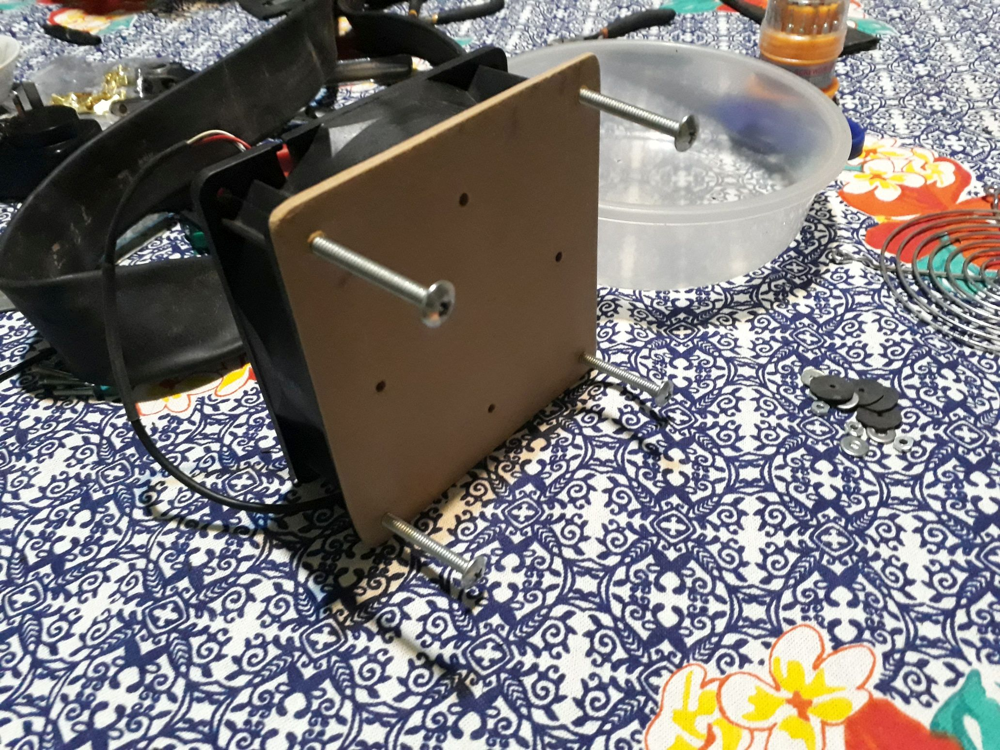
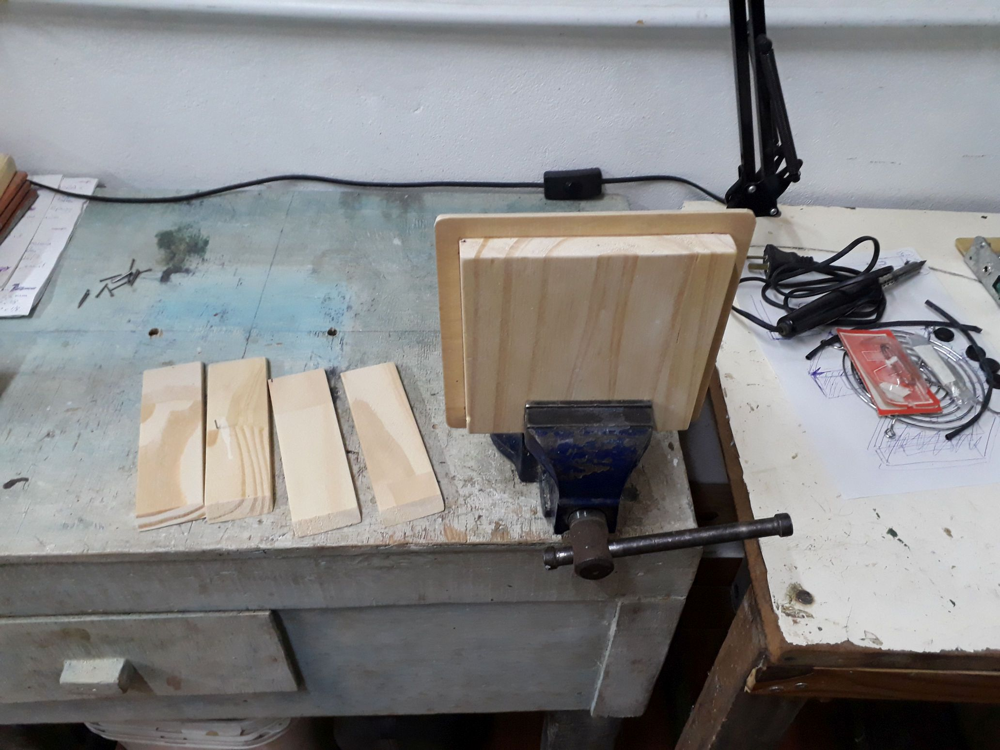

# Vibratory-Tumbler

Arduino code for a time-controlled vibratory tumbler.

&nbsp;

This project use the following electronic components:
- 1 x Arduino UNO / Nano v3
- 4 x push-button
- 1 x TM1637 IC (4 digit 7 segment display)
- 1 x relay module
- 1 x active buzzer
- 1 x 200 ohm resistor

Other components:
- Server cooler (12cms, 1A or more)
- Big Screw (to unbalance the cooler blades and generate the vibration)
- Misc: plastic container, screws, springs, some wood for the electronic box, paint ...

The circuit:
- Time increase push-button attached to pin 2
- Time decrease push-button attached to pin 3
- Start push-button attached to pin 4
- Pause/Stop push-button attached to pin 5
- TM1637 display attached to pins 7 & 8
- Relay module attached to pin 10
- Buzzer attached to pin 12 through a 200 ohm resistor

Notes:
- The timer scale can be adjusted between minutes/seconds using the SCALE constant.

&nbsp;

### Screenshots

| Materials                                     | Proof Of Concept                              |
|-----------------------------------------------|-----------------------------------------------|
|              |       |

| Proof Of Concept                              | Tumbler Structure                             |
|-----------------------------------------------|-----------------------------------------------|
|       |      |

| Tumbler Structure                             | Tumbler Structure                             |
|-----------------------------------------------|-----------------------------------------------|
|  |  |

| Electronic Protoboard                         | Electronic Protoboard                         |
|-----------------------------------------------|-----------------------------------------------|
|  |  |

| Electronic Soldering                          | Proyect Final                                 |
|-----------------------------------------------|-----------------------------------------------|
|   |  |

See 'Rescources' sub-folder for more pictures & videos of the project.

&nbsp;

### Version History

v1.0 (2021.05.24) - Initial release.  
v1.1 (2021.05.25) - Changing pins for better disposition on Arduino Nano.

&nbsp;

This source code is licensed under GPL v3.0  
Please send me your feedback about this app: andres.garcia.alves@gmail.com
